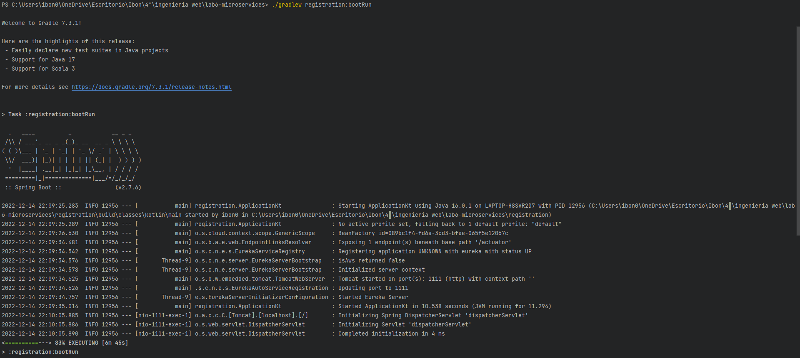
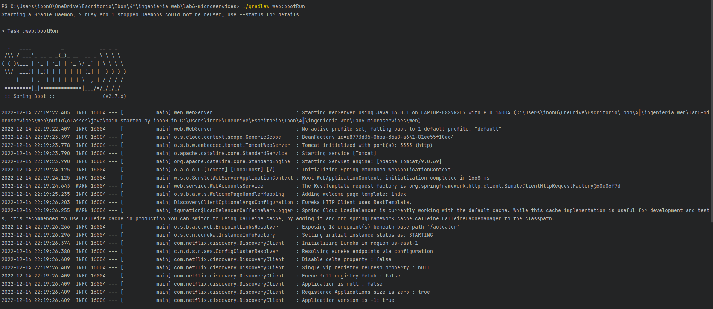
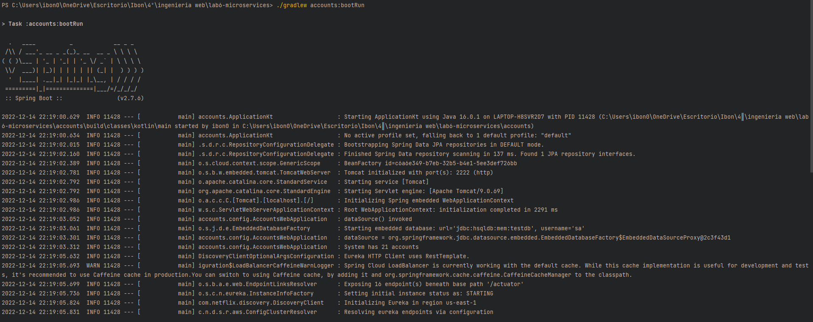
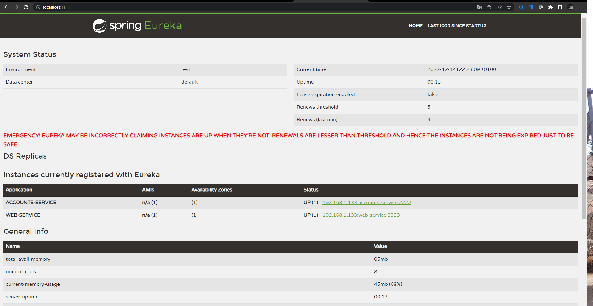
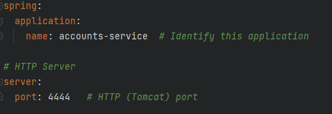
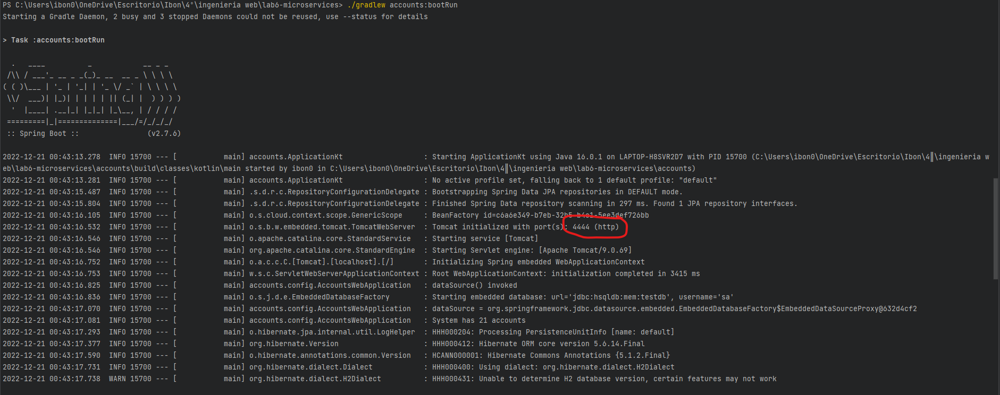
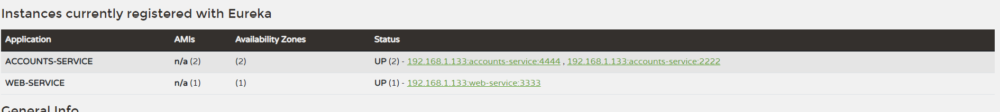
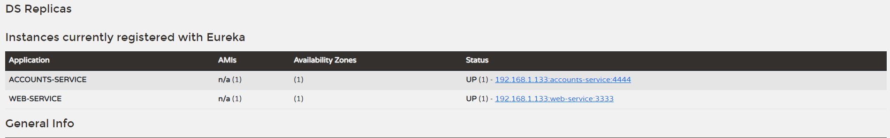
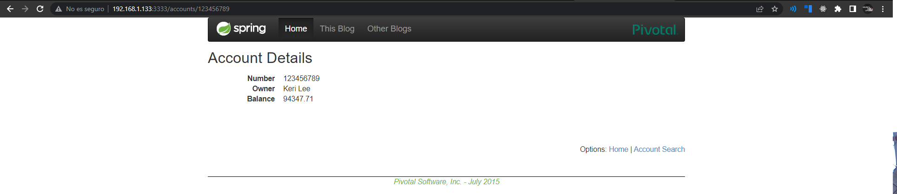

# REPORT

This document contains a brief of how the following activities have been accomplished:

- The two services `accounts (2222)` and `web` are running and registered (two terminals, logs screenshots).
- The service registration service has these two services registered (a third terminal, dashboard screenshots)
- A second `accounts` service instance is started and will use the port 4444. This second `accounts (4444)` is also
  registered (a fourth terminal, log screenshots).
- What happens when you kill the service `accounts (2222)` and do requests to `web`?  
  Can the web service provide information about the accounts again? Why?

## Steps
- First step is to run `registration` service. We do this typing `./gradlew registration:bootRun` in the terminal.

- Second step is to run `web` service. We do this typing `./gradlew web:bootRun` in the terminal.

- Third step is to run `accounts(2222)` service. We do this typing `./gradlew accounts:bootRun` in the terminal.

- Fourth step is to make sure all services have been launched correctly. To try it out we type localhost:1111 in 
the browser, where Eureka is allocated. And then, we can see both services (``accounts`` and ``web``) are allocated 
in Eureka(``registration``)

- Then we add a second accounts service instance, we will use the port 4444.

    And we run it
    
    
    
    Then both ``accounts`` services will appear in Eureka

- Nex step is to kill ``accounts(2222)`` and then make request to web

Request didn't fail because web is not only looking for accounts(2222), it is looking for accounts service in general. 
Despite we had killed accounts(2222), accounts(4444) was still alived and ``web`` did the request to that microservice. 
